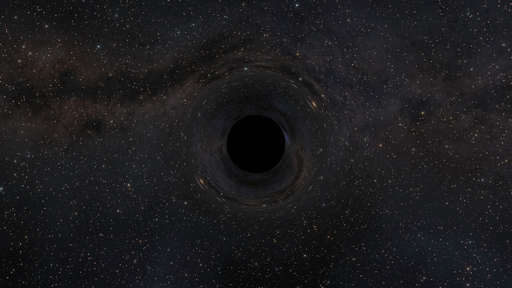

# planAGN: *planets near AGN*

[planAGN](https://github.com/jourdanwaas/planAGN) is a computational framework for modeling the impact of AGN-driven outflows on planetary atmospheres.

 

  

  <em>Image credit: NASA/JPL-Caltech/R. Hurt (IPAC)</em>

---

## Overview

[planAGN](https://github.com/jourdanwaas/planAGN) models how AGN-driven outflows deposit energy into planetary atmospheres, altering:

- Atmospheric heating
- Molecular velocity distributions
- Atmospheric escape
- Ozone depletion

---

## Associated Publication

[Waas, Jourdan, et al. "The Impact of Supermassive Black Holes on Exoplanet Habitability. I. Spanning the Natural Mass Range" *The Astrophysical Journal* 1003. 1 (2026): 35](https://iopscience.iop.org/article/10.3847/1538-4357/ae5e6f)

---

## Credits

This project builds on contributions from:

Francesco Tombesi, Amedeo Balbi, Alessandra Ambrifi, Emily Lohmann, Eric Perlman, Manasvi Lingam, Jackson Kernan, and Abhro Rahman.
